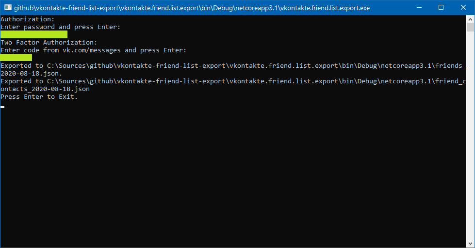
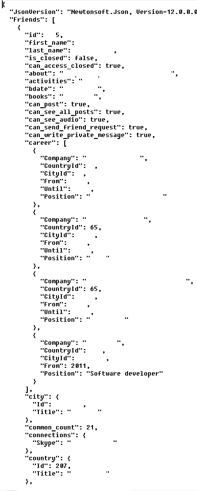

Exports the full friend list info into a JSON file

### Console output

### JSON example

### Authentication

Vk password is used together with an applicaion id you can create here https://vk.com/apps?act=manage 
Vk token can be preserved between sessions in *%temp%\vkontakte.lib* file. Please be aware.